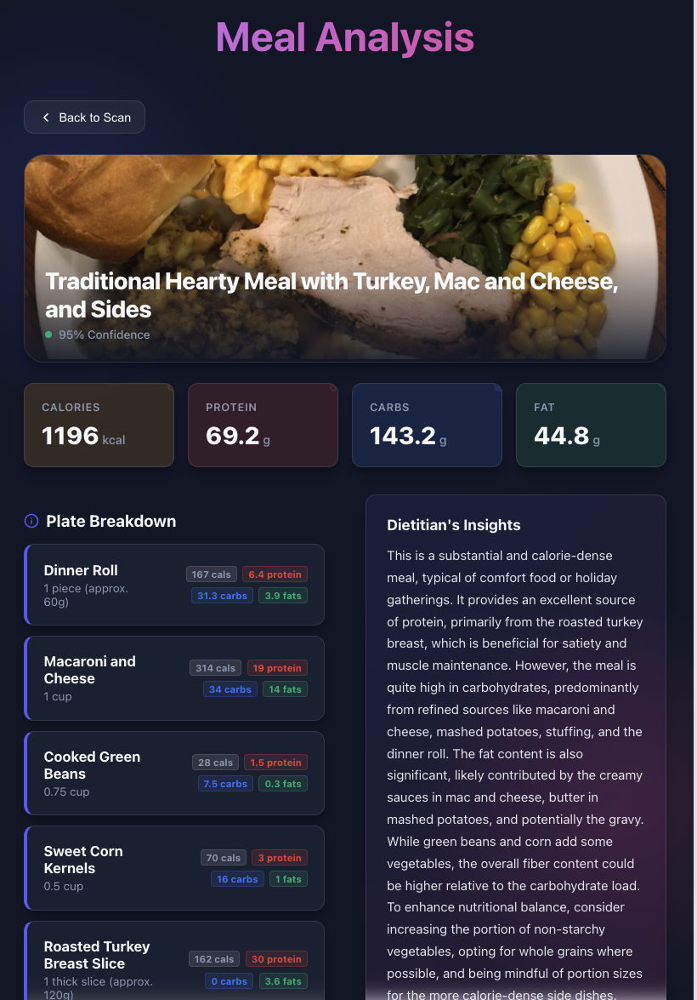

# Meal Analysis AI Agent

## Overview

This project provides a comprehensive solution for analyzing food images to estimate ingredients, portion sizes, and nutritional content. It consists of two main components:

1.  **AI Agent (Backend)**: deployed to **Vertex AI Agent Engine**, capable of visual identification, research, and nutritional estimation.
2.  **Web Application (Frontend)**: A React-based interface deployed to **Cloud Run**, allowing users to capture/upload images and interact with the agent directly.



## Operational Process

- **Visual Identification & Deconstruction**: The agent identifies distinct components (whole foods, branded goods) and analyzes contextual cues for portion sizing.

- **Research Protocol**: For branded items, the agent utilizes search capabilities to find official nutritional data.

- **Estimation & Calculation**: The agent estimates weights/volumes and maps them to nutritional values (Calories, Macros) to provide a detailed meal breakdown.

## Setup Environment

### Prerequisites

1.  **Google Cloud SDK (`gcloud`)**: Installed and authenticated.
    ```bash
    gcloud config unset project
    gcloud config unset billing/quota_project    
    gcloud auth application-default set-quota-project <PROJECT_ID>
    gcloud config set billing/quota_project <PROJECT_ID>
    gcloud auth application-default login
    gcloud auth login    
    ```

2.  **Terraform**: Installed (v1.0+).
    - [Install Terraform](https://developer.hashicorp.com/terraform/downloads)

3.  **Python 3**: Installed (for Agent Engine deployment script).

## Deployment and CI/CD Pipeline

This project uses **Cloud Build** as the primary CI/CD orchestrator. However, because Firebase Authentication requires manual setup in the Google Cloud Console before the frontend can successfully build, the deployment is split into two phases.

### Phase 1: Bootstrap (Run Locally Once)

Before Cloud Build can automatically deploy the application on every git push, you must set up the baseline infrastructure and configure Firebase Authentication.

1.  **Review Configuration**:
    - Check `terraform.tfvars` to ensure `project_id`, `region`, and `billing_account` are correct.
    
2.  **Initialize Terraform**:
    ```bash
    terraform init
    ```

3.  **Apply Base Infrastructure**:
    Run a targeted apply to stand up *only* the foundation without attempting to build the Docker image or deploy the Cloud Run service yet.
    ```bash
    terraform apply -target="google_project_service.apis" -target="google_firebase_project.default" -target="google_firebase_web_app.default"
    ```

4.  **Enable Firebase Authentication Manually**:
    -   Go to the [Firebase Console](https://console.firebase.google.com/)
    -   Select your new project
    -   Navigate to **Authentication** > **Get started** > **Sign-in method**
    -   Enable the **Google** provider.
    -   Navigate to the [Cloud Credentials Console](https://console.cloud.google.com/auth/clients/) and find the newly created Web OAuth client ID.
    -   Update `terraform.tfvars` with the `google_client_id`.
    -   Wait for Phase 2 to complete to get your Cloud Run URL, then come back and add the URL to the authorized redirect URIs and Javascript origins.

5.  **Migrate Local State to Remote State**:
    Since we used a local Terraform state file to bootstrap Phase 1, we must migrate the state to a Google Cloud bucket before handing off the pipeline to Cloud Build (GitOps).
    ```bash
    export PROJECT_ID="YOUR_PROJECT_ID"
    gcloud storage buckets create gs://${PROJECT_ID}-terraform-remote-backend --location=US --uniform-bucket-level-access
    gcloud storage buckets update gs://${PROJECT_ID}-terraform-remote-backend --versioning
    ```
    Then, properly define your `backend.tf` file so Terraform knows to switch to the cloud bucket:
    ```bash
    cat <<EOF > backend.tf
    terraform {
      backend "gcs" {
        bucket = "${PROJECT_ID}-terraform-remote-backend"
        prefix = "terraform/state"
      }
    }
    EOF
    ```
    Finally, initialize and migrate your local `.terraform.tfstate` up to the bucket:
    ```bash
    terraform init -migrate-state
    ```
    *(Note: Answer "yes" when asked if you want to copy the state to the new backend.)*

### Phase 2: GitOps Automated Deployments

Now that the foundation exists and the Terraform state is safely stored in Google Cloud, you can hand off orchestration to Cloud Build.

1.  **Configure Cloud Build Trigger**:
    - Go to Cloud Build in the GCP Console and connect your GitHub repository.
    - Create a Push-to-branch trigger for the `main` branch.
    - In the trigger settings, add a Substitution Variable:
      - Variable: `_VITE_GOOGLE_CLIENT_ID`
      - Value: *(Paste the OAuth CLIENT_ID from Phase 1)*

2.  **Trigger the Pipeline**:
    Commit your code and push to the `main` branch:
    ```bash
    git push origin main
    ```
    - Cloud Build will automatically initialize the GCS backend state bucket.
    - It will run `terraform apply` to deploy the Agent Engine.
    - It will build the Vite app with the injected Firebase secrets, package it into Docker, and push it to Artifact Registry.
    - Finally, it will update Cloud Run with the new image.

3.  **Finalize OAuth**:
    Once the pipeline finishes, grab the deployed Cloud Run URL from the Cloud console and add it to your OAuth Client ID authorized origins.

## Outputs

After a successful Cloud Build deployment, Terraform stores outputs in its GCS remote state:
- `cloud_run_url`: Example: `https://meal-analysis-service-...-uc.a.run.app`
- `agent_staging_bucket`: The GCS bucket used for agent code.

## Test Locally

### ADK Local API Server
This will start a local server that mocks the Agent Engine API. By default it will run on port 8000.

```bash
adk api_server .
```   
<br>

### Client Application
This will start the backend client application on port 8080. This serves the latest content in the /dist folder produced by the `npm run build` command.

```bash
npm install
node server.js
```
<br>

### [optional] Frontend Client Application
This will load the vite development server on port 5173. The moment you save a file, the browser updates instantly without a full page refresh. It uses the proxy configuration in `vite.config.js` to send any request starting with /api over to port 8080.

```bash
npm run dev
```

## Notes

- **Agent Engine**: The agent is deployed using a local Python script (`deploy.py`) wrapped in a Terraform `null_resource` because the native Terraform resource for Reasoning Engines is complex to use with local code.
- **State Management**: Terraform uses local state by default (`terraform.tfstate`). For team environments, configure a remote backend (e.g., GCS).
