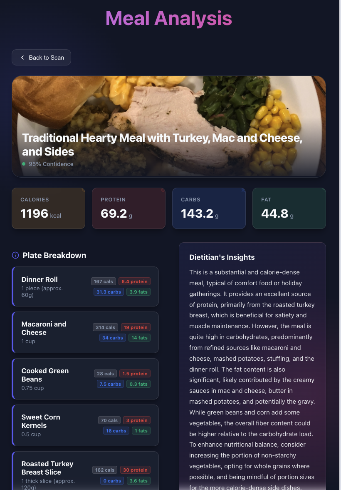

# Meal Analysis AI Agent

## Overview

This project provides a comprehensive solution for analyzing food images to estimate ingredients, portion sizes, and nutritional content. It consists of two main components:

1.  **AI Agent (Backend)**: deployed to **Vertex AI Agent Engine**, capable of visual identification, research, and nutritional estimation.
2.  **Web Application (Frontend)**: A React-based interface deployed to **Cloud Run**, allowing users to capture/upload images and interact with the agent directly.



## Operational Process

- **Visual Identification & Deconstruction**: The agent identifies distinct components (whole foods, branded goods) and analyzes contextual cues for portion sizing.

- **Research Protocol**: For branded items, the agent utilizes search capabilities to find official nutritional data.

- **Estimation & Calculation**: The agent estimates weights/volumes and maps them to nutritional values (Calories, Macros) to provide a detailed meal breakdown.

## Setup Environment

### Configure CLI
Ensure you have the Google Cloud SDK installed and authenticated.

```bash
# Setup Environment variables
export GOOGLE_CLOUD_PROJECT=
export PROJECT_NUMBER=
export GOOGLE_CLOUD_LOCATION=
export STAGING_BUCKET=

# Configure CLI
gcloud config set project $GOOGLE_CLOUD_PROJECT
gcloud config set billing/quota_project $GOOGLE_CLOUD_PROJECT
gcloud auth application-default login
```

### Enable APIs
```bash
printf 'y' | gcloud services enable cloudresourcemanager.googleapis.com
printf 'y' | gcloud services enable aiplatform.googleapis.com
printf 'y' | gcloud services enable cloudbuild.googleapis.com
printf 'y' | gcloud services enable run.googleapis.com
```

# Create Agent Engine Staging Bucket
```bash
gcloud storage buckets create gs://$STAGING_BUCKET \
    --location=$GOOGLE_CLOUD_LOCATION \
    --default-storage-class=STANDARD \
    --project $GOOGLE_CLOUD_PROJECT
```
### Setup Permissions
Grant necessary permissions to the default compute service account for building and deploying.

```bash
# Cloud Build Builder
gcloud projects add-iam-policy-binding $GOOGLE_CLOUD_PROJECT \
  --member="serviceAccount:$PROJECT_NUMBER-compute@developer.gserviceaccount.com" \
  --role="roles/cloudbuild.builds.builder"

# Storage Admin (for staging bucket)
gcloud storage buckets add-iam-policy-binding gs://$STAGING_BUCKET \
  --member="serviceAccount:$PROJECT_NUMBER-compute@developer.gserviceaccount.com" \
  --role="roles/storage.legacyBucketOwner"

# Logging
gcloud projects add-iam-policy-binding $GOOGLE_CLOUD_PROJECT \
  --member="serviceAccount:$PROJECT_NUMBER-compute@developer.gserviceaccount.com" \
  --role="roles/logging.logWriter"

# Artifact Registry Writer
gcloud projects add-iam-policy-binding $GOOGLE_CLOUD_PROJECT \
  --member="serviceAccount:$PROJECT_NUMBER-compute@developer.gserviceaccount.com" \
  --role="roles/artifactregistry.writer"

# Cloud Run Admin
gcloud projects add-iam-policy-binding $GOOGLE_CLOUD_PROJECT \
  --member="serviceAccount:$PROJECT_NUMBER-compute@developer.gserviceaccount.com" \
  --role="roles/run.admin"

# Service Account User
gcloud projects add-iam-policy-binding $GOOGLE_CLOUD_PROJECT \
  --member="serviceAccount:$PROJECT_NUMBER-compute@developer.gserviceaccount.com" \
  --role="roles/iam.serviceAccountUser"

# Reasoning Engine Express User
gcloud projects add-iam-policy-binding $GOOGLE_CLOUD_PROJECT \
  --member="serviceAccount:$PROJECT_NUMBER-compute@developer.gserviceaccount.com" \
  --role="roles/aiplatform.expressUser"
```

## Deploy the Agent

Deploy the managed backend to Vertex AI. Run the python deployment script to deploy the agent to the Agent Engine instance.

  ```bash
  python3 -m venv venv
  source venv/bin/activate
  pip install -r requirements.txt
  python3 deploy.py

  read -r AGENT_NAME AGENT_IDENTITY <<< $(curl -s -X GET \
      -H "Authorization: Bearer $(gcloud auth print-access-token)" \
      -H "Content-Type: application/json; charset=utf-8" \
      https://${GOOGLE_CLOUD_LOCATION}-aiplatform.googleapis.com/v1/projects/${GOOGLE_CLOUD_PROJECT}/locations/${GOOGLE_CLOUD_LOCATION}/reasoningEngines | jq -r '
    .reasoningEngines 
    | sort_by(.createTime) 
    | last 
    | "\(.name) \(.spec.effectiveIdentity)"
  ')  

  gcloud projects add-iam-policy-binding $GOOGLE_CLOUD_PROJECT \
      --member="principal://$AGENT_IDENTITY" \
      --role="roles/aiplatform.expressUser" 
  ```

## Deploy the Web App

### Deploy the Firebase Application

- Create Firebase Project: Navigate to the Firebase Console and create a new Web project and associate it with your Google Cloud Project.
- Enable Authentication: Under Build > Authentication, enable the Google Sign-In provider.
- Enable Firestore Database: Under Build > Firestore, standard mode, enable a new database (start in Production mode is fine, we will update rules next).
- Enable Firebase Storage: Under Build > Storage, start the service (start in Production mode is fine, we will update rules next).
- Get Config keys: Navigate to Project settings > Your apps to copy the new configuration parameters for your web app.
- Stringify the configuration object and save it inside your local `.env` file as `VITE_FIREBASE_CONFIG` along with exporting it to your terminal:

  ```bash
  export VITE_FIREBASE_CONFIG='{"apiKey": "AIzaSy...", "authDomain": "...", "projectId": "...", "storageBucket": "...", "messagingSenderId": "...", "appId": "..."}'
  echo -e "VITE_FIREBASE_CONFIG='$VITE_FIREBASE_CONFIG'" >> .env
  ```

### Securing Firebase Resources
To ensure users can only ever access their own scans, you must apply the following specific rules in your Firebase console.

**Firestore Security Rules:**
```json
rules_version = '2';
service cloud.firestore {
  match /databases/{database}/documents {
    match /scans/{document} {
      allow read, write: if request.auth != null && request.auth.uid == resource.data.userId;
      allow create: if request.auth != null && request.auth.uid == request.resource.data.userId;
    }
  }
}
```

**Firebase Storage Security Rules:**
```json
rules_version = '2';
service firebase.storage {
  match /b/{bucket}/o {
    match /scans/{userId}/{allPaths=**} {
      allow read, write: if request.auth != null && request.auth.uid == userId;
    }
  }
}
```
### Deploy the Frontend to Cloud Run. 

**Configure Environment**: You need the `REASONING_ENGINE_URL_BASE` and `VITE_GOOGLE_CLIENT_ID` variables for the Cloud Run deployment.

  ```bash
  # This URL should match your deployed Agent Engine resource name from the previous step
  export REASONING_ENGINE_URL_BASE="https://$GOOGLE_CLOUD_LOCATION-aiplatform.googleapis.com/v1/$AGENT_NAME"
  echo -e "\nREASONING_ENGINE_URL_BASE=$REASONING_ENGINE_URL_BASE" >> .env

  # Obtain a client ID from the OAuth consent screen
  export VITE_GOOGLE_CLIENT_ID="<YOUR_GOOGLE_CLIENT_ID>"
  echo -e "VITE_GOOGLE_CLIENT_ID=$VITE_GOOGLE_CLIENT_ID" >> .env
  ```

**Submit Build**: Use Cloud Build to build the Docker image and deploy to Cloud Run.

```bash
gcloud builds submit --config cloudbuild.yaml \
  --substitutions=_REASONING_ENGINE_URL_BASE="$REASONING_ENGINE_URL_BASE",_GOOGLE_CLIENT_ID="$VITE_GOOGLE_CLIENT_ID",_FIREBASE_CONFIG="$VITE_FIREBASE_CONFIG"
```

## Test Locally

### ADK Local API Server
This will start a local server that mocks the Agent Engine API. By default it will run on port 8000.

```bash
adk api_server .
```   
<br>

### Client Application
This will start the backend client application on port 8080. This serves the latest content in the /dist folder produced by the `npm run build` command.

```bash
npm install
# Ensure .env settings are correct
node server.js
```
<br>

### [optional] Frontend Client Application
This will load the vite development server on port 5173. The moment you save a file, the browser updates instantly without a full page refresh. It uses the proxy configuration in `vite.config.js` to send any request starting with /api over to port 8080.

```bash
npm run dev
```
